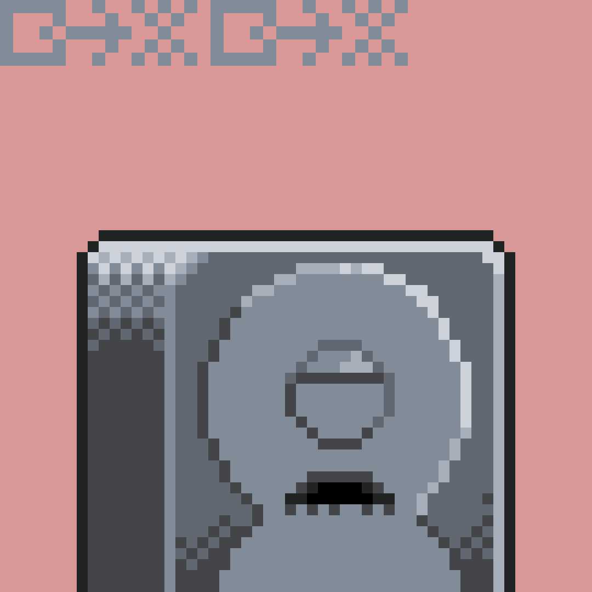
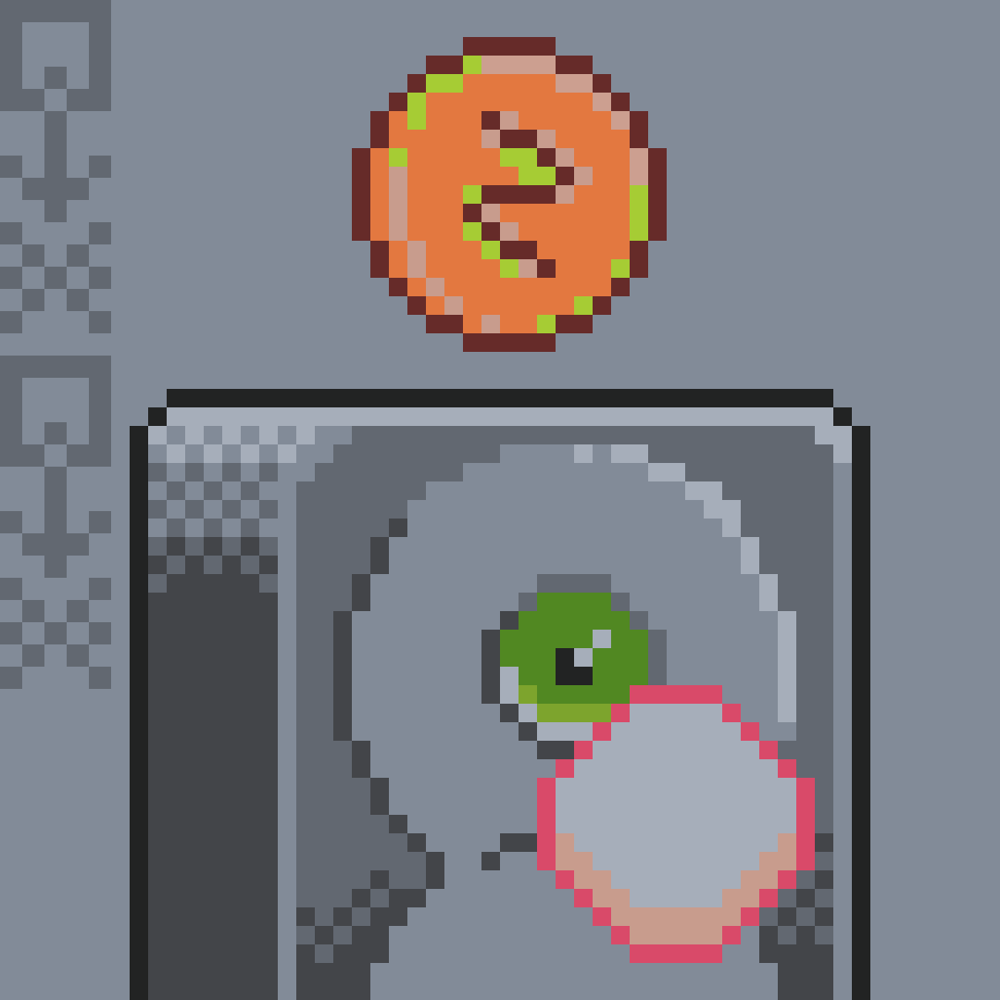
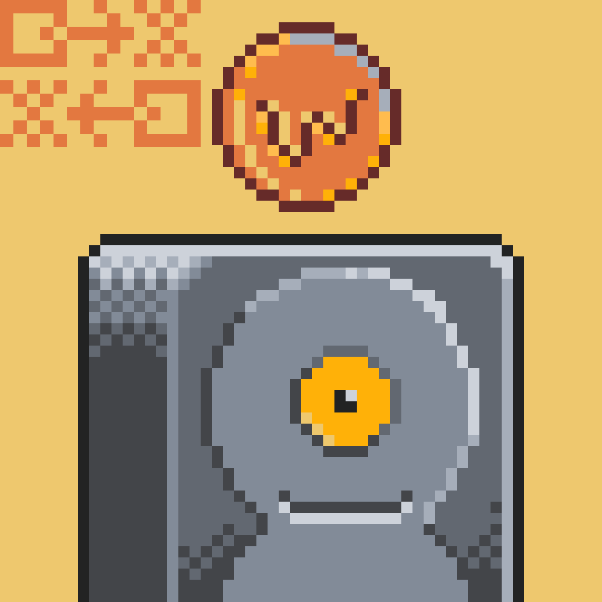
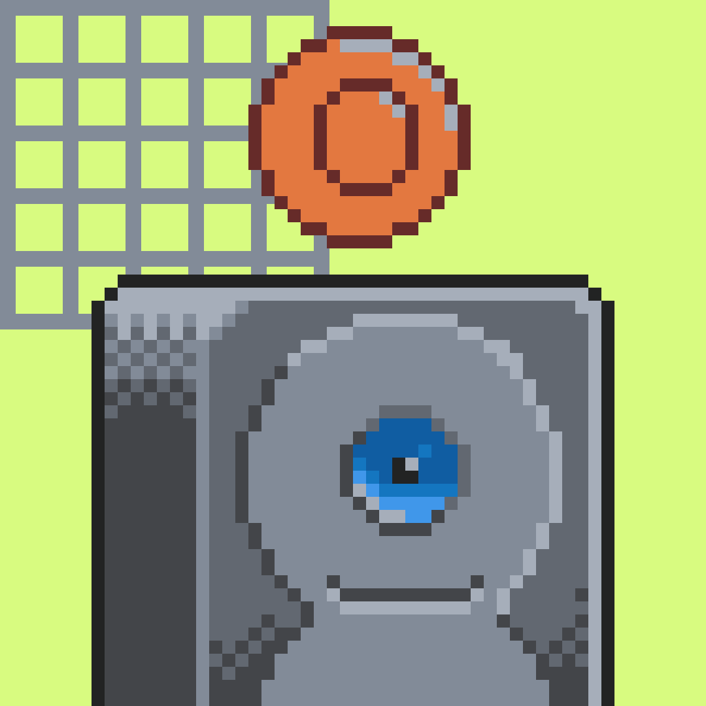

# Chia Friends Puzzle findings

## Knowns in the community

Some Links to sites that collect things that are known:

- [scotopic - The race to solve the Chia Friends puzzle](https://www.scotopic.xyz/the-race-to-solve-the-chia-friends-puzzle/)
- [chialinks Rarity List](https://chialinks.com/chiafriends/)

## New Attempts

My new attempts to find hints on the puzzle.....

These tips are from: [scotopic - The race to solve the Chia Friends puzzle](https://www.scotopic.xyz/the-race-to-solve-the-chia-friends-puzzle/)

Seth has mentioned a few things that could be interesting (@jon/ChiaLinks.com):

- K32s and Timelords are best friends
- Timelords should prompt a search/lookup on K32s
- He didn’t have control over the minting order
- you win a "coin" if you have the right "prove"
- (2022-07-06) confirmed mint numbers do not matter
- (2022-07-06) the unique chia designed NFTs aren’t part of the puzzle (the fact that they are unique)
- (2022-07-06) Chia legal team shut down the idea of a mnemonic/prize
- (2022-07-06) the solution to the puzzle is something Seth is hoping the community can use afterwards
- (2022-07-06) no steganography involved

Below my attempts to some parts

### Something significant about 1854
- Seth Jenks [posted on Twitter there is "something significant" on chia friend #1854](https://twitter.com/sethjenks/status/1544891610483556352)
- [Playfair cipher](https://en.wikipedia.org/wiki/Playfair_cipher) was invented in year 1854
- Sethjenks did not have control over order of chiafriends. So maybe nothing special in ChiaFriends NFT Data

### There are 25 Timelords

There are 25 Timelords. They can be layed out 5 x 5 like [Playfair Cipher](https://en.wikipedia.org/wiki/Playfair_cipher)

- [timelords_matrix.html](files/out/timelords_matrix.html)

### 26 keywords

There are 26 keywords starting with each letter of the alphabet (A-Z)

- [keywords.html](files/out/keywords.html)

I think this also has to do with [Playfair Cipher](https://en.wikipedia.org/wiki/Playfair_cipher)

### K32s and Timelords are best friends

K32s and Timelords are best friends. There are Timelords with a symbol on there body, and K32 with the same symbol as a coin above their head.

- [timelords_k32_best_friends.html](files/out/timelord_k32_best_friends.html)

### 42 matching Coins for each Timelord

For Each Timelord there are 42 Chia Friends with a Coin matching the Timelords Symbol.

- [timelord_coins.html](files/out/timelord_coins.html)

### 1865 K32 bodies

- [k32.html](files/out/k32.html)

### Hieroglyphs on K32 body images

Long time i wondered what this Hieroglyph metadata is. The Hieroglyphs are on the K32 Chia friends. They are a very small variation of background Color. But when you play around with brightness and contrast levels then they become clearly visible.
These also thematically have to do with [Playfair Cipher](https://en.wikipedia.org/wiki/Playfair_cipher)

{ class="gallery" }
{ class="gallery" }
{ class="gallery" }
{ class="gallery" }

## Scripts i use 

I am using a few powershell scripts to query through the metadata and to render these HTML pages so see what it looks like.

- <https://github.com/RudolfAchter/blockchain-stuff/tree/main/docs/chia/chia_friends_puzzle/files>


## Wrong attempts (possibly)

These are ideas i came up with, but are proven as wrong

### Something significant in #1854

Seth Jenks [posted on Twitter there is "something significant" on chia friend #1854](https://twitter.com/sethjenks/status/1544891610483556352).

There found an Alphabet in File 1854.png. When you look at this File with a Hex Editor at certain places it seems like every third Byte is a character of the alphabet. I wrote this powershell Script to analyze this.

```powershell
[byte[]]$bytes=[System.IO.File]::ReadAllBytes("/home/rudi/chia_puzzle/all_files/1854.png")

$char=""
$start=341
Write-Host("Start at Byte: " + $start)
for($i=$start;$i -le ($bytes.Count -1) -and $char -ne "}";$i=$i+3){
    $char=[System.Text.Encoding]::ASCII.GetString($bytes[$i])
    Write-Host ($char) -NoNewline

    if($char -eq "}"){
        Write-Host("")
        Write-Host("End at Byte: " + $i)
    }
}
```

This Extracts out of 1854.png starting from Byte 341 (decimal) Ending at Byte 581 (decimal)

```
Start at Byte: 341
ABBCDEEFGGHHIIIJJKKLLMNOPQRRSTUUVVWXXXYZ[\\]^_``aabccdeefgghijjklmnopqrrsstuvxy{}
End at Byte: 581
```
