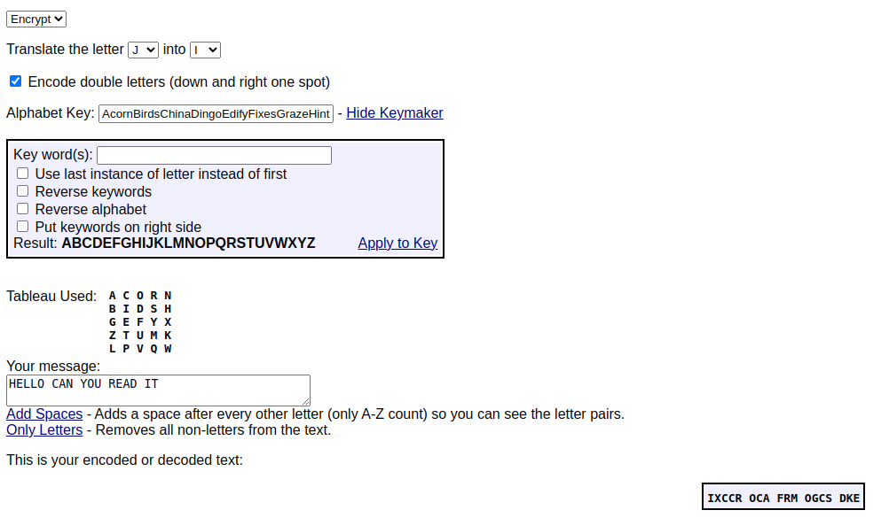
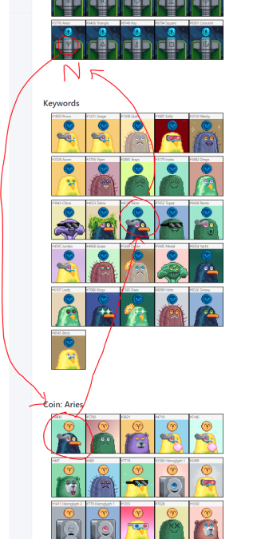

# Chia Friends Puzzle findings

## Scripts i use 

I am using a few powershell scripts to query through the metadata and to render these HTML pages so see what it looks like.

- <https://github.com/RudolfAchter/blockchain-stuff/tree/main/docs/chia/chia_friends_puzzle/files>


## Tools and Knowns in the community

Some Links to sites that collect things that are known:

- [scotopic - The race to solve the Chia Friends puzzle](https://www.scotopic.xyz/the-race-to-solve-the-chia-friends-puzzle/)
- [chialinks Rarity List](https://chialinks.com/chiafriends/)
- [Chia Friends Finder](https://chia-friends-finder.deno.dev/)
- [Cipher Identifier](https://www.dcode.fr/cipher-identifier)

Pretty sure we are talking about some sort of [Playfair Cipher](https://en.wikipedia.org/wiki/Playfair_cipher#Example)

- [Timelords -> Keywords -> Coins](https://discordapp.com/channels/947974432041881660/993022953421807657/994788618096873582)

## New Attempts

My new attempts to find hints on the puzzle.....

These tips are from: [scotopic - The race to solve the Chia Friends puzzle](https://www.scotopic.xyz/the-race-to-solve-the-chia-friends-puzzle/)

- There are 10K friends
    - 9998 are PNG
    - 2 are GIF (#880 and #9098)
  - https://www.bueno.art/ was used for assembling the collection
  - Seth has mentioned a few things that could be interesting (@jon/ChiaLinks.com) :
    - K32s and Timelords are best friends
    - Timelords should prompt a search/lookup on K32s
    - He didn’t have control over the minting order
    - you win a “coin” if you have the right “prove”
  - (2022-07-06) confirmed mint numbers do not matter
  - (2022-07-06) the unique chia designed NFTs aren’t part of the puzzle (the fact that they are unique)
  - (2022-07-06) Chia legal team shut down the idea of a mnemonic/prize
  - (2022-07-06) the solution to the puzzle is something Seth is hoping the community can use afterwards
  - (2022-07-06) [no steganography involved](#something-significant-in-1854)
  - Seth provided clue(s):
    - ["There is something significant about 1854"](#something-significant-about-1854) ( note Amethyst is seth’s birth stone )
  - (@jon/ChiaLinks.com): Timelords starting point -> K32 -> coin
  - [There are 25 Timelord bodies with these symbols](#there-are-25-timelords).
  - [There are 1865 K32 bodies](#1865-k32-bodies).
  - [There are 26 Keywords with these symbols](#26-keywords).
    - starts with each letter of the alphabet
    - not all BIP-39 words
  - (2022-07-06) [There are 318 PNGs with transparent backgrounds](#).
  - (2022-07-06) @nezee - 5 NFTs have “XCH” tokens

This i have found in [XCH Foundation Discord](https://discord.gg/zGhYtMwW) - chia-friends-puzzle Channel

- Jon has a theory that the symbols align to greek letters <https://discordapp.com/channels/947974432041881660/993022953421807657/994837116607533057>
- `The ASCII code 42 is for the asterisk "*" symbol, being a wildcard for everything.` [Phrases from The Hitchhiker's Guide to the Galaxy](https://en.wikipedia.org/wiki/Phrases_from_The_Hitchhiker%27s_Guide_to_the_Galaxy#The_Answer_to_the_Ultimate_Question_of_Life,_the_Universe,_and_Everything_is_42)
    - <https://www.rapidtables.com/code/text/ascii-table.html>
- Jon attemted this [Timelord -> Matching Coin -> Matching Keyword](#timelords---keyword---coins)


- [Playfair Cipher](https://en.wikipedia.org/wiki/Playfair_cipher#Example) seems to be a more modern form of [Polybius square](https://en.m.wikipedia.org/wiki/Polybius_square)


Below my attempts to some parts

### Something significant about 1854
- Seth Jenks [posted on Twitter there is "something significant" on chia friend #1854](https://twitter.com/sethjenks/status/1544891610483556352)
- [Playfair cipher](https://en.wikipedia.org/wiki/Playfair_cipher) was invented in year 1854
- Sethjenks did not have control over order of chiafriends. So maybe nothing special in ChiaFriends NFT Data

### There are 25 Timelords

There are 25 Timelords. They can be layed out 5 x 5 like [Playfair Cipher](https://en.wikipedia.org/wiki/Playfair_cipher)

- [timelords_matrix.html](files/out/timelords_matrix.html)

### 26 keywords

There are 26 keywords starting with each letter of the alphabet (A-Z)

- [keywords.html](files/out/keywords.html)

I think this also has to do with [Playfair Cipher](https://en.wikipedia.org/wiki/Playfair_cipher)

### K32s and Timelords are best friends

K32s and Timelords are best friends. There are Timelords with a symbol on there body, and K32 with the same symbol as a coin above their head.

- [timelords_k32_best_friends.html](files/out/timelord_k32_best_friends.html)

### 42 matching Coins for each Timelord

For Each Timelord there are 42 Chia Friends with a Coin matching the Timelords Symbol.

- [timelord_coins.html](files/out/timelord_coins.html)

### 1865 K32 bodies

- [k32.html](files/out/k32.html)

### Hieroglyphs on K32 body images

Long time i wondered what this Hieroglyph metadata is. The Hieroglyphs are on the K32 Chia friends. They are a very small variation of background Color. But when you play around with brightness and contrast levels then they become clearly visible.
These also thematically have to do with [Playfair Cipher](https://en.wikipedia.org/wiki/Playfair_cipher).

**These are Hieroglyphs 1,2,3,4**

The Numbers and hieroglyphs stay the same. 

| Hieroglyphs 1                                               | Hieroglyphs 2                                               | Hieroglyphs 3                                               | Hieroglyphs 4                                               |
| ----------------------------------------------------------- | ----------------------------------------------------------- | ----------------------------------------------------------- | ----------------------------------------------------------- |
|  |  |  |  |

### Transparent Backgrounds

There are 318 PNGs with transparent background (alpha channel in png). I rendered them with a checkerboard background to visualize it.

- [Transparent Background / Alpha Channel](files/out/alpha_channel.html)


### Hello can you read it?

- <https://discordapp.com/channels/947974432041881660/993022953421807657/995404456298565654>

@topper used all the keywords and a [Playfair Chipher tool](http://rumkin.com/tools/cipher/playfair.php)

OK basically he literally inserted all Keywords sorted by alphabet

```text
AcornBirdsChinaDingoEdifyFixesGrazeHintsIndexJumboKingsLeafyMedalNicerOxideProveQuirkRemixSnowyTopazUsageViperWackyXraysYachtZebra
```



### Timelords -> Keyword -> Coins

@jon in Discord

- <https://discordapp.com/channels/947974432041881660/993022953421807657/994788618096873582>



So i tried search Timelord -> Matching Coin -> Matching Keyword

i matched the Keyword by:

- Accessories
- Body
- Eyes
- Mouth
- Background

- [timelord_coin_keyword_match_abemb.html](files/out/timelord_coin_keyword_match_abemb.html)

in a second attempt i ignored background so i matched by:

- Accessories
- Body
- Eyes
- Mouth

- [timelord_coin_keyword_match_abem.html](files/out/timelord_coin_keyword_match_abem.html)


### 42 the answer to the universe and everything


## Wrong attempts (possibly)

These are ideas i came up with, but are proven as wrong

### Something significant in #1854

Seth Jenks [posted on Twitter there is "something significant" on chia friend #1854](https://twitter.com/sethjenks/status/1544891610483556352).

There found an Alphabet in File 1854.png. When you look at this File with a Hex Editor at certain places it seems like every third Byte is a character of the alphabet. I wrote this powershell Script to analyze this.

```powershell
[byte[]]$bytes=[System.IO.File]::ReadAllBytes("/home/rudi/chia_puzzle/all_files/1854.png")

$char=""
$start=341
Write-Host("Start at Byte: " + $start)
for($i=$start;$i -le ($bytes.Count -1) -and $char -ne "}";$i=$i+3){
    $char=[System.Text.Encoding]::ASCII.GetString($bytes[$i])
    Write-Host ($char) -NoNewline

    if($char -eq "}"){
        Write-Host("")
        Write-Host("End at Byte: " + $i)
    }
}
```

This Extracts out of 1854.png starting from Byte 341 (decimal) Ending at Byte 581 (decimal)

```
Start at Byte: 341
ABBCDEEFGGHHIIIJJKKLLMNOPQRRSTUUVVWXXXYZ[\\]^_``aabccdeefgghijjklmnopqrrsstuvxy{}
End at Byte: 581
```
