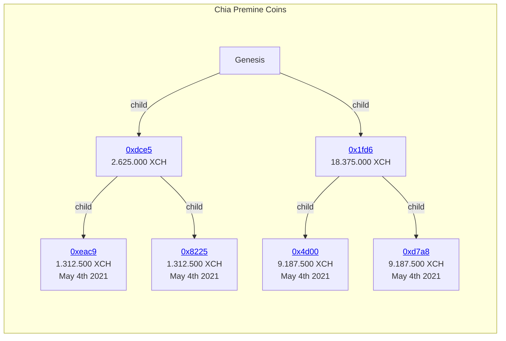

# Chia Premine

## Chia Premine and where it stays on Blockchain

### You cannot audit the wallets

In Chia Blockchain you could theoretically have a new address for each and every transaction, which provides pseudo-anonymity on the public blockchain. Transactions cannot easily be matched to a single identity. You CAN be auditet with [Observer Keys](https://docs.chia.net/docs/09keys/keys-and-signatures/#non-observer-vs-observer-keys), but you can decide who is allowed to audit you. So wallets are not publically auditable.

### But you can follow the coins

One thing you CAN follow perfectly, are the coins itself. Each coin created has a parent. You can follow parents ultimately until "Genesis", the start of the whole blockchain. When a coin is "spent" it will be destroyed and split into children with new values transferred to the new destination (which also can be your own wallet. Think of "change" when you deal with cash.). You can perfectly trace on blockchain which coins are spent and which are not. The exact premine amount is divided into 4 coins which stay there unspent since [May 4th 2021](https://en.wikipedia.org/wiki/Star_Wars_Day) (really? Exactly 10th anniversary of Star Wars Day? 👍)

these (shortened) hashed are linked to [xchscan.com](https://xchscan.com). You can check "Parent Coin" and "Child Coins" for each transaction. As long these coins stay "unspent" and have no childs, they really were not touched

