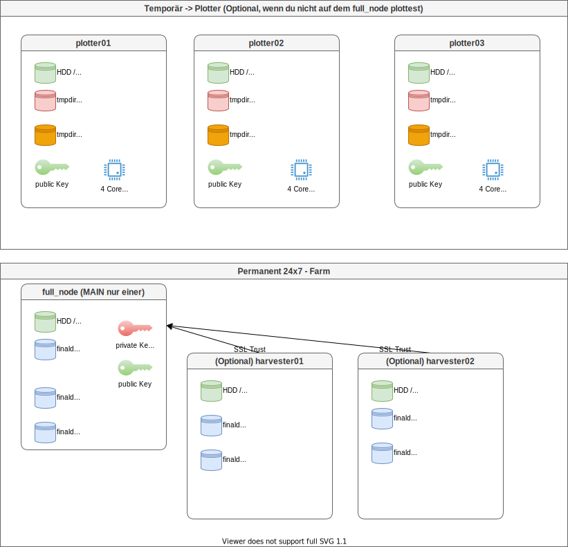

# Chia Quickstart

## Überblick

Es ist ein einfacher Grundsatz beim Chia Farmen zu verfolgen.
- Du brauchst temporär SCHNELLEN Speicher zum Plotten (NVME / SSD / Ramdisk) und CPU Power (Quad Core 3 Ghz wär schon gut)
  - Du kannst alle Rechner die du temporär findest zum Plotten benutzen :-) -> die Plotter bekommen nur Public Keys
- Du brauchst lange Zeit (Jahre) GROSSEN Speicher zum Farmen (HDD 15 TB)

Die folgende Grafik zeigt, wie eine Chia Farm skaliert werden kann.



Die Plotter sind temporär und müssen nur laufen solange die großen Festplatten befüllt werden. Wenn ein Main Node nicht reicht und zusätzliche Festplatten nicht an einen Host angeschlossen werden können können weitere Hosts als Harvester betrieben werden. Dies hat auch den Vorteil, dass bei der Suche eines "Proofs" auf den Festplatten alle Harvester gleichzeitig nach dem Proof suchen können.

Die Plotter brauchen Power. Der Full Node kann ein Raspberry Pi4 sein.
Du willst 10 Festplatten am RPI 4 anschließen? Es soll billig sein? Kein Problem -> [Amazon - Icy Box IB-3810U3 ](https://www.amazon.de/IB-3810U3-Externes-Festplatten-schaltbar-Smart-L%C3%BCfter/dp/B01GPXNLC4/ref=sr_1_1_sspa?__mk_de_DE=%C3%85M%C3%85%C5%BD%C3%95%C3%91&keywords=icy+box+hdd+10+bay+usb&qid=1636899922&sr=8-1-spons&psc=1&spLa=ZW5jcnlwdGVkUXVhbGlmaWVyPUEzMjVTWlZGWEsyU1ZSJmVuY3J5cHRlZElkPUEwODg3NDY0M0JIU0JEVFBVRkE5VCZlbmNyeXB0ZWRBZElkPUEwNzgzNzgzMzEyV1M2SktETVVLSCZ3aWRnZXROYW1lPXNwX2F0ZiZhY3Rpb249Y2xpY2tSZWRpcmVjdCZkb05vdExvZ0NsaWNrPXRydWU=)

## Chia auf der CommandLine

Da alle Chia Forks gleich funktionieren, erkläre ich das ganze anhand von Beispielen der Chia Forks die ich verwendet habe.
Du wirst auf den offiziellen Projekt Seiten immer ähnliche Anleitungen finden.

## User
verwende einen sudo Berechtigten User um Chia (oder seine Forks) zu installieren. Verwende am besten einen separaten User (NICHT sudo Berechtigt) um die Clients zu betreiben.
Du hast mindestens 3 User

- root -> Der User den wir NICHT verwenden
- rudi -> der Sudo Berechtigte User der root werden darf
- chia -> OHNE Sudo Rechte -> dieser User betreibt die Chia Clients

Wenn du GANZ auf Nummer sicher gehen willst, legst du pro Chia Fork wieder einzelne User an. Jeweils ohne Sudo Rechte:

- hddcoin
- flax
- flora
- usw

## Installation

Die Installation stellt erst mal die Python Pakete und die Binaries bereit. Du bekommst lediglich die "commands" für die Ausführung. Es wird noch nichts eingerichtet oder Konfiguriert.

### Installation via Source Code

hierfür brauchst du kein Sudo. Du kompilierst die Binaries in deinem User Profil. Ich habe das z.B. bei HDDCoin auf meinem Raspberry gemacht, da es keine ARM64 Binaries hierfür gibt.

```bash
cd ~
mkdir hddcoin
cd hddcoin
git clone https://github.com/HDDcoin-Network/hddcoin-blockchain.git
cd hddcoin-blockchain/
sh install.sh
```

Bei Chia wäre das dann natürlich so

```bash
cd ~
mkdir chia
cd chia
git clone https://github.com/Chia-Network/chia-blockchain.git
cd chia-blockchain/
sh install.sh
```

Das ist auch schon alles. Bei Chia ersetze hddcoin durch chia und durch die URLs des Chia Projekts. Die Einrichtung und Konfiguration des Chia Clients ist ein anderes Thema

### Installation via Debian Paket

Flora betreibe ich auf einem x64 Prozessor. Bei Flora habe ich hier also passende Debian Pakete.
Als sudo Berechtigter User machst du so etwas hier

```bash
wget https://github.com/Flora-Network/flora-blockchain/releases/download/0.2.12/flora-blockchain_0.2.12_amd64.deb
sudo apt install ./flora-blockchain_0.2.12_amd64.deb
#Flora für die Command Line ist nun installiert

#Aus bequemlichkeit will ich Flora direkt im Path haben
#Flora finden (geht genauso mit Chia)
sudo find / -name flora

#Flora verlinken (chia macht das z.B. automatisch)
sudo ln -s /usr/lib/flora-blockchain/resources/app.asar.unpacked/daemon/flora /usr/local/bin/flora
```

Jetzt sollte z.b. flora Betriebsbereit sein

## Verwendung des Clients
je nachdem wie du den Client installiert hast, musst du etwas anders machen um den Client verwenden zu können.

### Wenn über Paketmanager installiert

Wenn du den Client via Distributionspaket installiert hast, hast du in der Regel eine "binary" die du direkt ausführen kannst (im Beispiel oben habe ich "flora" verlinkt)

```bash
flora
```

### Wenn über Sourcecode Installiert

Wenn du den Client über Sourcecode installiert hast. Wurde im Zielverzeichnis eine Python virtual Environment installiert. Diese musst du aktivieren um die Chia Commands zur verfügung zu haben

```bash
cd chia-blockchain
. ./activate
```

Deine Prompt verändert sich. Es steht "(venv)" vorne dran
```text
(venv) ubuntu@cloud:~/install/chia-blockchain
```

Nun solltest du die chia Commands zur Verfügung haben

```bash
chia -h
#Hilfe
```

## Initialisierung

Bei den folgenden Abschnitten gehe ich davon aus, dass du das jeweilige Chia (oder Fork) Python Environment aktiviert hast und somit das jeweilig Chia command zur Verfügung hast.
Bei der Initialisierung eines Chia Clients werden Konfigurationsdaten, Datenbanken, Keys, Zertifikate und dergleichen in ein verstecktes Verzeichnis in deinem Homeverzeichnis geschrieben.

z.B.
- $HOME/.chia
- $HOME/.flora
- $HOME/.hddcoin

Die Ordnerstruktur darunter sieht immer so aus (diese wird erst bei Initialisierung geschrieben):

- .chia
  - mainnet
    - cache
    - config # hier liegt die Konfigurationsdatei für deinen User
      - ssl # Eine SelfSigned CA und Zertifikate mit denen deine Chia Komponenten kommunizieren
    - db # hier liegt die Blockchain Database (sqlite). **Um schneller starten zu können, kannst du die komplette Blockchain DB von einer vertrauenswürdigen Quelle kopieren**
    - log # hier wird geloggt
    - run
    - wallet # hier liegt deine Wallet Database

Führe die Initialisierung mit dem User aus, der die Chia Farm betreiben soll

z.B.

```bash
su - chia
```

dann Initialisierst du deinen Client
```bash
chia init
```

## Erstellen eines private Keys

Das erste was du brauchst in ein private Key. Der private Key ist dein kritischster Bestandteil dieser Installation und darf nie in unbefugte Hände geraten. Bei Erstellung des Keys bekommst du ein "24 word mnemonic". Mit diesem mnemonic kann der Key wiederhergestellt werden. Notiere dieses am besten zwei mal auf Papier und hebe es an zwei unterschiedlichen Orten auf.

```bash
#Generieren
chia keys generate

#Deine 24 secret words nochmal anzeigen
chia keys show --show-mnemonic-seed
```

## Oder importieren eines private Keys

Hast du bereits einen private Key erstellt und willst z.B. deine Plots auch in anderen Chia Forks verwenden musst du den selben private Key in die anderen Clients importieren

```bash
#Importieren mit Hilfe der 24 words
chia keys add
```

## Starten des Farmers

Bei starten des Farmers wird deine Wallet, dein FullNode, dein Harvester und dein Farmer gestartet. Dein Full Node beginnt damit sich mit der Blockchain zu synchronisieren. **Das kann einige Tage dauern**

Hier bemerken wir nun einen Vorteil der Commandline gegenüber der GUI. Auf der Commandline wird ein Daemon gestartet und du kannst dich wieder aus dem System ausloggen. Startest du die GUI dann starten die Daemons automatisch mit. Allerdings werdenmit der GUI auch automatisch alle Daemons beendet. Bedeutet, einmal mit der GUI gestartet, darfst du dich nicht mehr von der GUI Abmelden.
Aber nun starten wir erst mal unseren Farmer

```bash
chia start farmer
```

Du beginnst mit der Blockchain zu synchronisieren. Dein FullNode muss voll synchronisiert werden bevor du XCH Coins verdienen kannst. Du kannst aber bereits **vorher schon mit dem Plotten beginnen**
Deinen aktuellen Status siehst du dann so

```bash
chia show --state --connections
```

z.b.

```text
Current Blockchain Status: Full Node Synced

Peak: Hash: db08d075673cdf95f8a1550958ddc98b04961537fe25400471224159ddf71417
      Time: Sun Nov 14 2021 08:28:13 CET                  Height:    1138722

Estimated network space: 35954.135 PiB
Current difficulty: 3008
Current VDF sub_slot_iters: 135266304
Total iterations since the start of the blockchain: 4279546468297

  Height: |   Hash:
  1138722 | db08d075673cdf95f8a1550958ddc98b04961537fe25400471224159ddf71417
  1138721 | 828258873c67056847bd4246f171e7a96192d2bbd903a57dc1b5ca9e4f48be3b
  1138720 | 2944b1fe31877b4c2050132c2ccbaa8ce0aa2ba24254513fa585ca5c540b4def
  1138719 | 5de2e20f416cefc2a1643ccdf7f91ef2d409ba84b72f460e7e6b09547b0da1da

Connections:
Type      IP                                     Ports       NodeID      Last Connect      MiB Up|Dwn
FARMER    127.0.0.1                              38916/8447  6f859972... Nov 10 09:53:17      4.1|0.0    
WALLET    127.0.0.1                              39034/8449  2af00103... Nov 14 08:27:42     72.5|0.2    
FULL_NODE 109.136.117.75                          8444/8444  1de41420... Nov 14 08:27:47     16.5|36.1   
                                                 -SB Height:  1138722    -Hash: db08d075...
FULL_NODE 211.72.136.88                           8444/8444  2867716e... Nov 14 08:27:48      9.3|141.2  
                                                 -SB Height:  1138722    -Hash: db08d075...
FULL_NODE 81.100.17.198                           8444/8444  4c8203c5... Nov 14 08:27:47     27.6|56.0   
                                                 -SB Height:  1138722    -Hash: db08d075...
```

## Pool oder Nicht Pool

in der Regel willst du einem Pool beitreten. Der Chia Netspace ist inzwischen schon so groß, dass du etliche Petabytes Speicher brauchst um eine Chance zu haben einen Plot zu gewinnen. Mit Pools kannst du Bruchteile gewinnen und verdienst so auch Chia.

Um einem Pool beizutreten -> folge dem Chia Pooling Guide
- https://github.com/Chia-Network/chia-blockchain/wiki/Pooling-User-Guide#how-to-start-pooling-in-6-steps

Unter https://faucet.chia.net/ kannst du dir ein bisschen Mojo auf deine Wallet überweisen lassen um ein NFT für das Pooling plotten zu können. Du solltest 0.000000000010 XCH vom Faucet bekommen. Alternativ kann dir auch ein Freud Mojo überweisen.

Du trittst dan einem Pool bei indem du einen Plot für den Pool erstellst

z.b.

```bash
chia plotnft create --fingerprint 116privatekeyFingerprint --pool_url https://eu1.pool.space --fee 0.000000000001
```

## Plotten der Files für Chia

Bei Chia geht es darum Speicherplatz für das Netzwerk bereitzustellen. Das machst du in dem du eine Art "Bingo Karten" auf deine Festplatten Plottest. Das Plotten ist der **Resourcenintensivste Teil** des Chia Farmings. Du musst nur zu beginn Plotten bis der Speicherplatz deiner Festplatten mit Plots belegt ist. Diese Plots kannst du dann über Jahre verwenden. Aktuell sind "32k Plots" aktuell. Es kann sein, dass mit besserer Hardware es notwendig wird z.B. "33k Plots" zu plotten. Das ist aber noch Zukunftsmusik

Komplette Guides zum Plotten findest du hier:
- [Plotting Basics](https://www.chia.net/2021/02/22/plotting-basics.html)
- [Alternative Plotter](https://github.com/Chia-Network/chia-blockchain/wiki/Alternative--Plotters) (ich z.B. verwende [MadMax](https://github.com/madMAx43v3r/chia-plotter))
  - MadMax wird inzwischen in den Original Chia Client integriert. Ich verwende noch immer den von der MadMax Seite: https://github.com/madMAx43v3r/chia-plotter
  - Aber siehe mal `chia plotters -h` (in der aktuellen Version des Chia Clients)
- [Plot k sizes aktuell ist 32k Standard](https://github.com/Chia-Network/chia-blockchain/wiki/k-sizes)
- [Command Reference](https://github.com/Chia-Network/chia-blockchain/wiki/CLI-Commands-Reference)

## Ressourcen zum Plotten
beim Plotten werden temporäre Files geschrieben auf denen sehr viele IOPS generiert werden. Für ein 110 GB Plot File weren mehrere Terrabytes an Daten geschrieben bevor das endgültige Plotfile geschrieben werden kann. Du brauchst schnelle SSDs oder genügend RAM und die temporären Files zu schreibnen sonst dauern ein eiziger Plot Tage.

Entweder eine 512GB **ausdauernde** SSD / NVME z.B. https://www.seagate.com/de/de/internal-hard-drives/ssd/firecuda-ssd/

Oder 128 GB RAMDisk für 75% der IOPs
und 350 GB RAMDisk oder SSD für 25% der IOPs (z.B. bei Verwendung von MadMax Plotter)

Das Plotten muss nicht auf deinem Main Node stattfinden. Du kannst z.B die Farm auf einem kleinen strom sparenden Raspberry Pi4 laufen lassen während du das temporär aufwendige Plotting auf einer Leistungsfähigen Workstation laufen lässt. **Der Plotter benötigt keine private Keys**. Du musst dem Plotter lediglich ein paar PUBLIC Keys mitgeben. Das bedeutet, theretisch könntest du das Plotten an einen externen Dienstleister Outsourcen.

## So wird geplottet

Mein Plot Script sieht z.B. so aus (MadMax Plotter):

Erst mal musst du deine Keys rausbekommen:
Das hier machst du auf deinem MAIN Node. Deine Wallet und Farmer Public Keys:
```bash
chia keys show
```

Notiere deinen FarmerPublicKey

```text
Showing all private keys:

Fingerprint: 116privatekeyFingerprint
Master public key (m): 95a5150d3f208bdfMasterPublicKey
Master private key (m): 4d4fe183a636a3MasterPrivateKey
Farmer public key (m/12381/8444/0/0): a5e7f85c750d654e5fa7ae36a82ffFarmerPublicKey
Pool public key (m/12381/8444/1/0): 97373c34069ca480819a6PoolbPublicKey
First wallet key (m/12381/8444/2/0): aa7633ae18259477273a320f32d85FirstWalletKey
First wallet address: xch14n2vdvh5yx6th9rfjk6dheazt49mFirstWalletAddress
```

Deine Pool NFT Keys:

```bash
chia plotnft show
```

Notiere deine Pool Contract Address

```text
Wallet height: 1139037
Sync status: Synced
Wallet id 2: 
Current state: FARMING_TO_POOL
Current state from block height: 623409
Launcher ID: 9bcf0aLauncherId
Target address (not for plotting): xch19PlotTarget
Number of plots: 385
Owner public key: af4OwnerPK
Pool contract address (use ONLY for plotting - do not send money to this address): xch1PoolContractAddress
Current pool URL: https://eu1.pool.space
Current difficulty: 7
Points balance: 559
Points found (24h): 3749
Percent Successful Points (24h): 99.97%
Relative lock height: 64 blocks
Payout instructions (pool will pay to this address): xch1PayoutInstructions
```

Mein Script für das Plotting über den Pool sieht dann z.B. so aus:
wenn du über die GUI Plotten willst, bedenke, dass für den gesamten Plot Vorgang die GUI geöffnet bleiben muss. Dieses Script kann wie bereits erwähnt auf einem ganz anderen Rechner laufen. Du kannst auf dem anderen Rechner z.B. NUR den MadMax Plotter installieren (ohne den vollen Chia Client). Der Plotter benötigt keinen private Key. Lediglich die hier erwähnten PoolContractAddress und FarmerPublicKey.

Die Files die du Plottest kannst du im nachhinein auch kopieren / verschieben. Bedenke aber, dass jeder Plot einzigartig sein muss.

```bash
#!/bin/bash
POOL_CONTRACT_ADDRESS=xch1PoolContractAddress
FARMER_PUBLIC_KEY=a5e7f85c750d654e5fa7ae36a82ffFarmerPublicKey
FAST_DISK=/chiatmp/plot01/
TMP_DISK=/chiatmp/plot02/
FINAL_DISK=/mnt/chia/farm03/
LOGFILE=/var/log/chia/chia_plot.log

echo "Starting Plot "`date +%Y-%m-%d_%H-%M-%S` >> $LOGFILE

#Temporaere Verzeichnisse ausleeren
rm $FAST_DISK*
rm $TMP_DISK*
rm $FAST_DISK2*
rm $TMP_DISK2*
#Ich starte den Prozess mit "nice" und im Hintergrund. Mit -n 100 sage ich es sollen 100 Plots in die "FINAL_DISK" geschrieben werden
nice -n 10 chia_plot -n 100 -2 $FAST_DISK -t $TMP_DISK -d $FINAL_DISK -c $POOL_CONTRACT_ADDRESS -f $FARMER_PUBLIC_KEY 2>&1 >> $LOGFILE & echo $! > $PLOT_PIDFILE &
```

## Hinzufügen von Plots zum Farmer

Wenn du auf einer anderen Maschine geplottet hast, dann machst du das folgende wieder auf deinem MAIN Node (dort wo du deinen Chia Client mit `chia init` initialisiert hast).

Du kannst Plots aus mehreren Pfaden zu deiner Chia Farm hinzufügen. Nimm die Pfade die zu den `*.plot` Dateien führen.

```bash
chia plots add --final_dir /mnt/chia/hdd01
chia plots add --final_dir /mnt/chia/hdd02
chia plots add --final_dir /mnt/chia/hdd03
```

## Prüfen der Plots auf Gültigkeit

Du kannst auch die Gültigkeit deiner Plots testen

```bash
chia plots check
```
