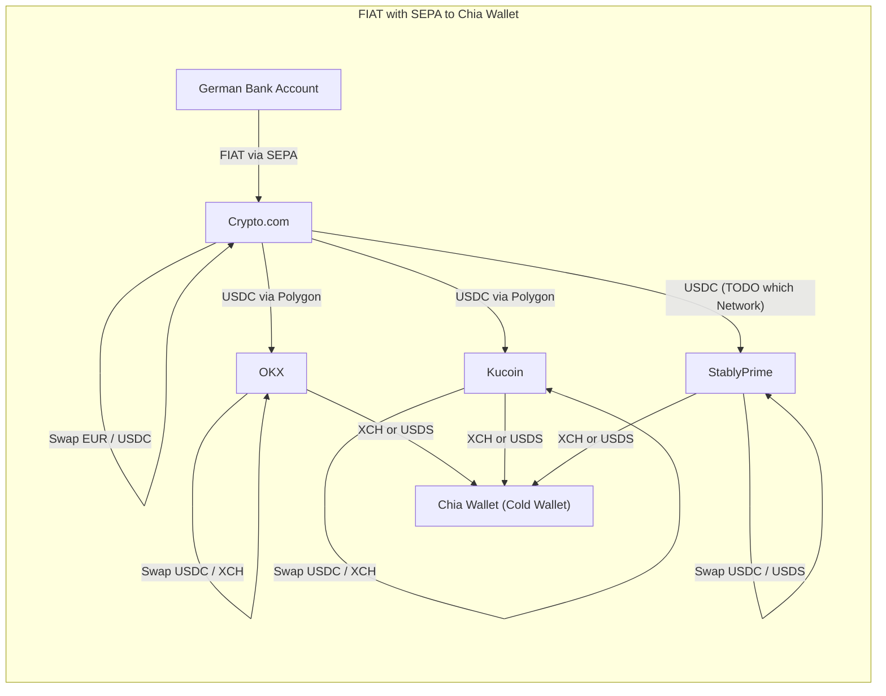
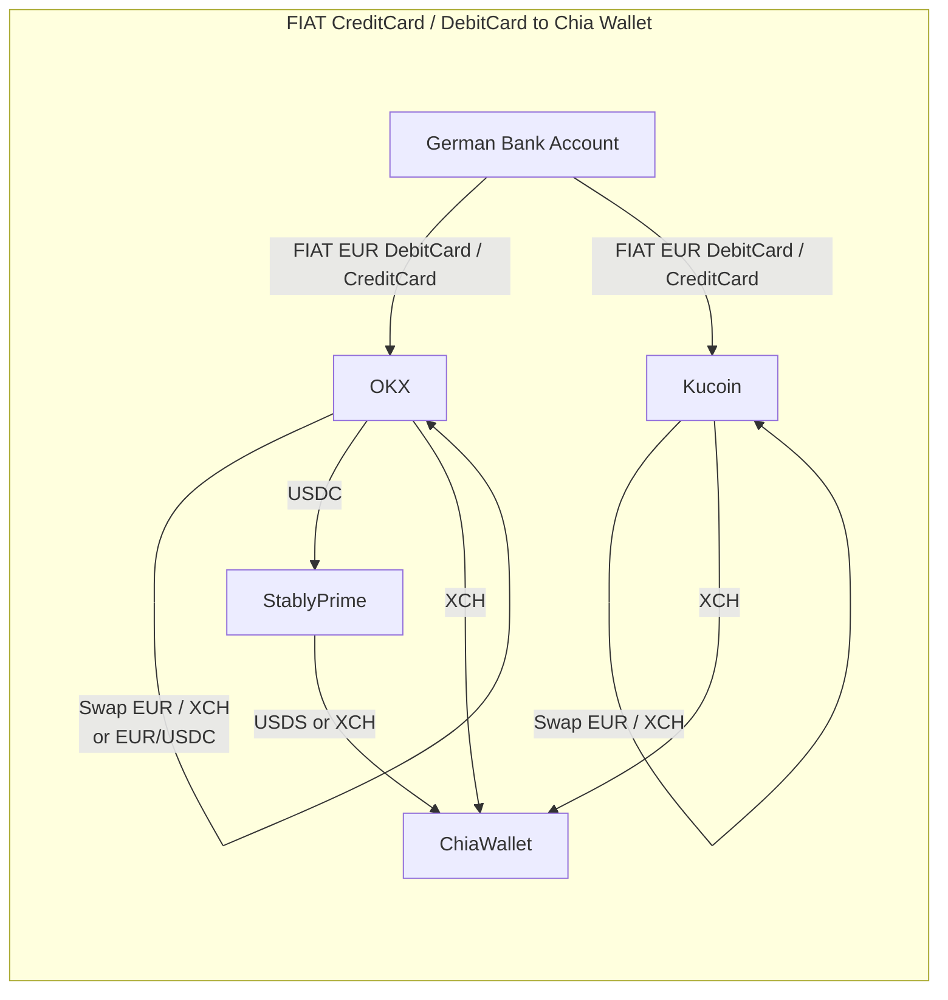
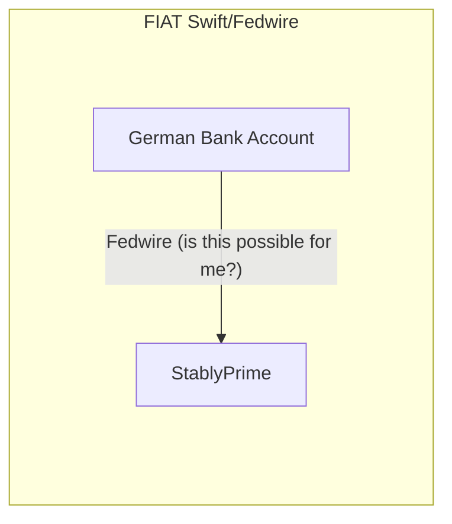

# Chia Wallets

- **[Chia Official Wallet](https://www.chia.net/download/)**: This i would recommend the most. Its the most secure and reliable way to safe your Chia, CATs and NFTs
- [Ozone Chia Mobile Wallet](https://ozonewallet.io/) : Ozone Wallet looks promising for Mobile Clients. But there is no support for NFT and DID / Chia Profiles already. Wallet seems to be the same Tech like Chia Light Wallet. The wallet is created on your device. So it's self custody.
- [Nucle.io Chia Modile Wallet](https://nucle.io/) : Nucle.io can Transfer Chia and one CAT Token. But also no NFT and DID Support. It's self custody. Wallet is directly on you device not relying on a Cloud Service
- [SkyNFT](https://skynft.org/nft_my_nft.php) : At Sky NFT you can have a Custodian Wallet. Wallet is managed by SkyNFT. It's mainly for Minting and Trading your NFTs on SkyNFT. **i do not recommend to hold your savings on a non Custodian Wallet**. To Save your Funds Transfer them to a Self Custody Wallet.
    - And [this is an example to not  hold your savings on a non custodian wallet](https://twitter.com/SkyNFTorg/status/1589467115010289669)

## How get FIAT to Chia Wallet

For your crypto assets to be safe, you want them to be in your own self custody wallet rather than on any centralized exchagne. Look at these examples:

- [Mt. Gox died during 2012/2013 Bear market](https://de.wikipedia.org/wiki/Mt.Gox)
- [Quadriga Fintech Solutions/QuadrigaCX died during 2018/2019 Bear market](https://en.wikipedia.org/wiki/Quadriga_Fintech_Solutions)
- [FTX died during 2022/2023](https://en.wikipedia.org/wiki/FTX_(company))

So this are opportunites i have here in Europe / Germany

### From the EU (Germany)

#### FIAT SEPA Transaction

I do whatever of this is the cheapest for me. The SEPA thing with Crypto.com i know really good. There is a Bank in Lithuania where Crypto.com gives me a Bank Account and i can transfer Euros to. SEPA transfer lasts two or three business days but works reliably to me. This then counts to my "Fiat Wallet" in the crypto.com app from where i can buy crypto from and can withdraw it on several crypto networks **but not Chia Network**. But for example with USDC from there the travel goes on through the several crypto exchanges we know.

#### FIAT CreditCard / DebitCard

Second Option is with CreditCard / Debit Card. But there typically is a **2 or 3% fee** on the transfer. So if its possible i stay with SEPA.

#### FIAT Fedwire Stably possible?

**I don't know if i am able to do this!**. Until now i found no way to directly Transfer FIAT to Stably Prime. Maybe its not possible for Europeans? At least not possible for me as a "normal guy" :-D.

