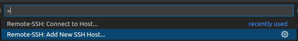
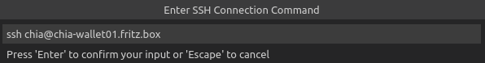
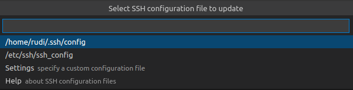
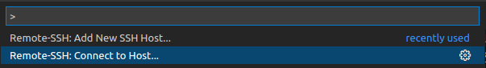
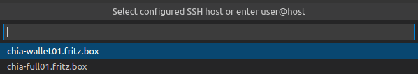
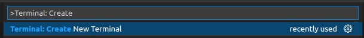
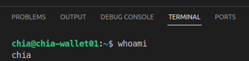

---
tags:
    - Tech
    - Linux
    - Chia
    - Powershell
    - Ansible
    - Development
---

# Chia Test Environment

I want to develop some little tools for myself.
But i dont want to play around with my real money in the case i mess it up.
So i need a test environment connected to chia testnet

## Deploying lxd

I use lxd on rasbian (arm64 / 64 bit arm) and on my workstation (amd64) for this.

- <https://snapcraft.io/install/lxd/raspbian>

Install and configure lxd / lxc in a way it works for you. This is what i did:

- [Virtualization with lxd](virtualization_lxd.md)

## What environment am i on

To get the right packages i want to know on which environment i am working.

```bash
lsb_release -a
```

So iam on Debian 11 (wich is my current raspbian version)

```text
No LSB modules are available.
Distributor ID: Debian
Description:    Debian GNU/Linux 11 (bullseye)
Release:        11
Codename:       bullseye
```

And whats the architecture?

```bash
uname -a
```

`aarch64` so i am on a 64bit arm processor

```text
Linux cloud 5.15.32-v8+ #1538 SMP PREEMPT Thu Mar 31 19:40:39 BST 2022 aarch64 GNU/Linux
```

## Deploying Ubuntu Image for my Testhost

For the next steps i `sudo`ed to root. So i am root for all these steps.
If you prefer to not be root you should add `sudo` to all these (lxc related) commands.

So what are the right images for my host?

```bash
lxc image list images:ubuntu/jammy arch=arm64
```

my choice is `ubuntu/jammy/cloud`

```bash
lxc launch images:ubuntu/jammy/cloud chiatest
```

i don't want my testhost to start automatically (resources)

```bash
lxc config set chiatest boot.autostart false
```

OK Login to Container and Test

```bash
lxc exec chiatest /bin/bash
```

Looks good

```text
root@chiatest:~# hostname
chiatest
root@chiatest:~# whoami
root
```

## putting it all together

Fast forward launching an image when lxd / lxc is prepared

Launch a image

```bash
lxc launch images:ubuntu/focal/cloud chia-full01
```

Prepare it for ansible.

- <https://github.com/RudolfAchter/chia-test-environment/blob/main/src/lxd/prepare_lxd_guest.sh>

```bash
bash ./prepare_lxd_guest.sh
```


## Configuring a development environment with ansible

### Prerequesites

So i installed ansible on my ubuntu development machine (not "chiatest" VM. My Development Workstation)

```bash
sudo apt install ansible
#no clue why i also need this python module. but was necessary
pip install ansible
```

### Create your ssh private public keypair

if you haven't already. Create a ssh private public keypair

```bash
ssh-keygen -t rsa -b 4096
```

Save it in default path `~/.ssh/id_rsa`. Ansible will be using key and public-key from default path.


### Ansible Inventory and Playbook

Clone this repoository `https://github.com/RudolfAchter/chia-test-environment`

```bash
git clone https://github.com/RudolfAchter/chia-test-environment
```

Follow instructions

- <https://github.com/RudolfAchter/chia-test-environment>

Basically what the ansible playbook does

- <https://github.com/RudolfAchter/chia-test-environment/blob/main/src/ansible/playbook/chia-test.yml>
- It installs ubuntu desktop
- Installs all necessary packages for chia full node
- installs xrdp and git

So you have a virtual desktop environment where you can play around with your chia full node.

## Remote Development

My virtual Machine does not hav as many recsources as my workstation has. And via Remote Desktop Protocol, VNC or whatever your developmet will not run as smooth as on a local machine. I am using [VS Code](https://code.visualstudio.com/) as my development IDE. One feature i like very much is [Remote Development using SSH](https://code.visualstudio.com/docs/remote/ssh).Install [Remove Development Extensionpack](https://marketplace.visualstudio.com/items?itemName=ms-vscode-remote.vscode-remote-extensionpack) in VsCode.

In VS Code Press `F1` or `CTRL + P` and run command "Remote-SSH: Add new Host



Beforehand your public key must be in file `~/.ssh/authorized_keys` of user chia. If you installed the test environment with my ansible script then the key should already be there. Enter the ssh command to login to your remote SSH Host. For example `ssh chia@chia-wallet01.fritz.box`



per default the ssh config file of your user will be updated. You simply can press enter again.



After adding this Host you can connect to it.



Choose you connected host and press enter



A new vscode Window opens. Look at the top of the new window. Maybe VsCode asks you the host Type of the new Host to install a vscode Server. Choose Linux if you are asked.

Start a new Terminal there when you are connected



You see you are now `chia@chia-wallet01`




