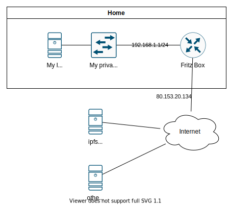

# Chia NFT 1 Standard

Here is the official Chia NFT Introduction

- [Chia NFT Introduction](https://devs.chia.net/guides/nft-intro/)

So now you know how to mint a NFT. But your NFT data isn't saved in the chia blockchain (this is what it isn't designed for. Its designed for making immutable transactions. Is's a ledger). So:

Me: "How to save your NFT data" You: "use a HDD"<br>
Me: "How to immutable save your NFT data" You: "burn a CD ROM"<br>
Me: "How save your NFT data immutable, accessible and distributed" You "..."<br>
Me: "Shut up, you know what i mean"

## Save your NFT Data on a internet distributed Filesystem

The Systems i know (so far) that are used for saving NFT Data are (for example):
- [ipfs.io](https://ipfs.io/)
- [arweave.org](https://www.arweave.org/)

I go with ipfs.ip with a typical Home Environment



Installing with user in sudo group

```bash
wget https://dist.ipfs.io/kubo/v0.14.0-rc1/kubo_v0.14.0-rc1_linux-amd64.tar.gz
tar -xzf kubo_v0.14.0-rc1_linux-amd64.tar.gz
cd kubo
sudo ./install.sh 
```

After installing as normal User i go with the [cli quickstart guide for ipfs](https://docs.ipfs.io/how-to/command-line-quick-start/)

```bash
ipfs init
ipfs cat /ipfs/_myHash_/readme
ipfs daemon
```

This runs the daemon now with this user account in the current shell. I would need to write a service file for systemctl to start the service on system start and keep it running

This loads a spaceship launch picture from the ipfs network.

```bash
ipfs cat /ipfs/QmSgvgwxZGaBLqkGyWemEDqikCqU52XxsYLKtdy3vGZ8uq > ~/Desktop/spaceship-launch.jpg
```

To get my own file into ipfs i did this:

```bash
ipfs add -q Test-Logo.svg
```

This returns a hash for the file you can use to load it again. You also can save this directyl in a variable:

```bash
hash=`ipfs add -q Test-Logo.svg`
```

then try to Get your File again

```bash
curl "https://ipfs.io/ipfs/$hash"
```

And what? .... Timeout!

Now comes the part the Quickstart documentation leaves out. In my Home environment i am behind NAT. The other IPFS nodes cannot reach me directly. Also there are addresses. Per Default ipfs tries the following.
- Announces all your addresses it knows
- Your public IP is also determined (i think it tests against a web service or so)
- Tries to open a port via UPNP

now the security settings on my rounter dont allow UPNP per default. But instead of simply enabling UPNP i precisely open a port for this service

i configured this snippet of `~/.ipfs/config`

- i use port **14001** tcp and udp
- i do not announce any private ip addresses

```json
  "Addresses": {
    "Swarm": [
      "/ip4/0.0.0.0/tcp/14001", 
      "/ip4/0.0.0.0/udp/14001/quic"
    ],
    "Announce": [],
    "AppendAnnounce": [],
    "NoAnnounce": [
        "/ip4/127.0.0.1/tcp/14001",
        "/ip4/127.0.0.1/udp/14001/quic",
        "/ip4/192.168.1.144/tcp/14001",
        "/ip4/192.168.1.144/udp/14001/quic"
    ],
  }
```

after doing these settings and restarting the ipfs daemin again `ipfs id` annouced only these addresses i am reachable over the internet now.

One Terminal for Server

```bash
ipfs daemon
```

Another for controlling the daemon

```bash
ipfs id
```

So now i am reachable via public ip

```
	"Addresses": [
		"/ip4/188.99.88.253/udp/14001/quic/p2p/12D3KooWAxssPeDfPZ82t8HYQhkWwUfgjWyHMuYkGCkJMrdp8ZoZ"
	],
```


