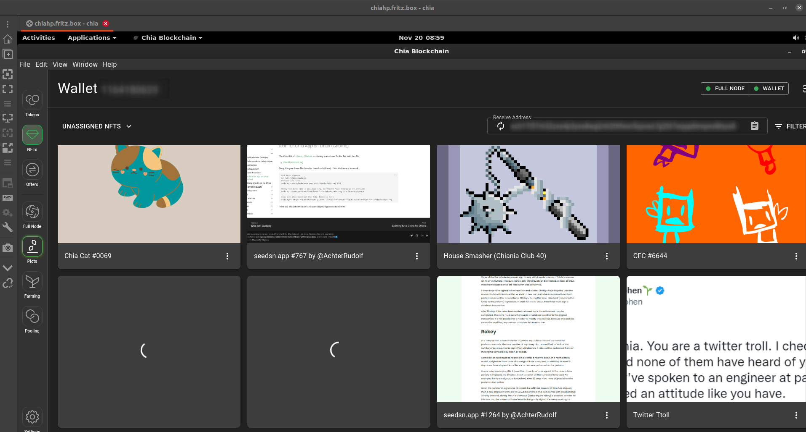
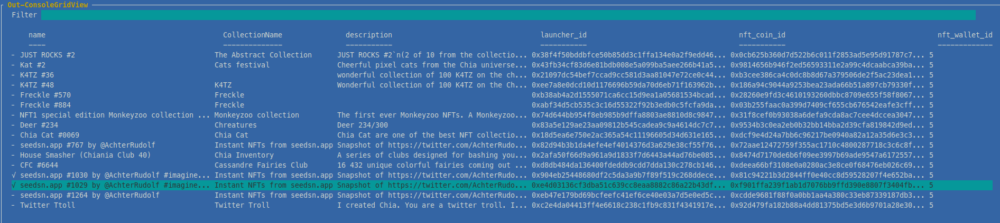
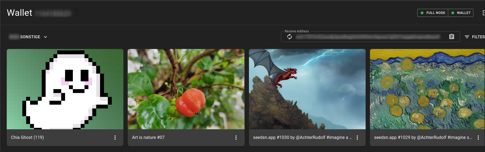

# NFT Troubleshooting

This are things about Troubleshooting with Chia NFTs. Examples that i came over.

## Two NFTs Messing up my Chia Wallet (NFT Section)

November 2022: I recently have the problem that my Chia Wallet Gui throws JavaScript errors when i open my unassigned NFTs. There are then two NFTs never showing up but instead showing an endless loading circle.



In the GUI itself i have no possibility to identify which NFTs are creating this problem because it shows nothing at all.

OK i have to go to the command line...

so what about

```bash
chia wallet nft list -i 5
```

Äh what? OK i never listed my NFTs on the chia command line. So maybe i am doing something wrong here, or i have an issue on command line too

```text
Failed to list NFTs for wallet with id 5 on key 000000000: 'edition_number'
```

OK i have another Tool. One thing i am programming is [ChiaShell](https://github.com/RudolfAchter/ChiaShell) which is a powershell Module for Chia which communicates with your chia node via RPC.

So i open powershell and do...

```powershell
Show-ChiaNfts -wallet_id 5 -View Grid
```

and from here i can see that there are two NFTs that aren't shown in my GUI

- seedsn.app #1029
- seedsn.app #1030



OK there is a problem with these two. To test if they are really causing the issue i put them into a different NFT Wallet / DID.

Command line and GUI seems to be fucked up, while RPC still is working so i use my powershell Tool

```powershell
$selected_nfts=Select-ChiaNfts -wallet_id 5
$selectedWallet=Select-ChiaWallet

<#
The Select-Whatever Commandlets in my ChiaShell Tool open such Grid dialogues what you have seen in the screenshot above. Whatever you select there is then sent to StdOut. So basically i saved my selections in the variables $selected_nfts and $selectedWallet
#>
```

Then i can do something like this using the Chia RPC API via ChiaShell

```powershell
Set-ChiaNftDid -nfts $selected_nfts -new_did $selectedWallet.did
```

This transfers the selected NFTs in a Batch to the SelectedDID.

After transferring these NFTs to a new DID they show up without an error. Okay now this is weird. So this is not a problem with the NFTs itself, but with my chia wallet?


