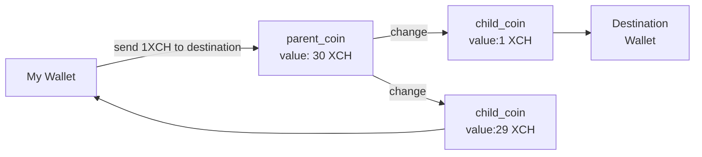
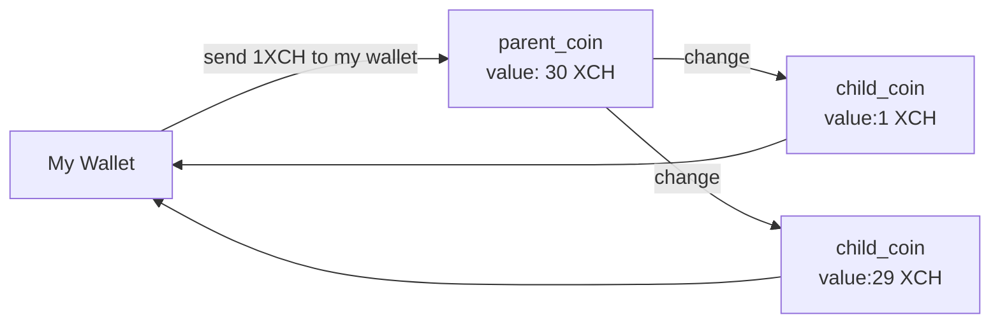

# Splitting Chia Coins for Offers

today i wanted to publish a few chia offers on these Chia offer sites. I want my "customers" to be able to buy the coins in small orders (for DCA or like that). So i decided to make multiple 1 XCH offers. After making one offer and trying to make a second offer i got an error message saying that i am not able to spend anymore coins. What? There is enough XCH in there. Then i remembered i read something how chia coins work.

I transferred my XCH from exchange to this wallet in one transaction. So there was "physically" ONE Coin in my wallet with a "value" of 30 XCH. But i want to make 20 x 1 XCH offers from there. What chia does when you spend coins looks like this:



So the one big coin is split into two "smaller" coins. One is sent to destination. The other one i get back as "change". Think of it like change when you buy your coffee with cash.

So what do i do now with my offers? I make change myself!



When i do this 30 times i have 30 coins with value of 1 XCH. Luckily we don't have to pay transaction fees yet. So basically when i want to make 30 offers i have to do 30 transactions first to have the coins for this (if all XCH came in one transaction). When i spend the "parent_coin" i have to wait until the transaction is complete before i can start the next transaction.

OK i have to automate this. I dont want to wait and click for each and every coin. I am a PowerShell Guy, so i came up with "ChiaShell" for automating things with my Chia Client. For this particular job i am using the [wallet_rpc_api](https://github.com/Chia-Network/chia-blockchain/blob/main/chia/rpc/wallet_rpc_api.py) from chia.

I wrote this Powershell Module

- [ChiaShell](https://github.com/RudolfAchter/ChiaShell)

It is all very basic at the start. But it is a good starting point for playing with the chia RPC API

and this is the script which uses the module.

- [chia-split-coins.ps1](https://github.com/RudolfAchter/ChiaShell/blob/master/Powershell/Scripts/chia-split-coins.ps1)

```powershell
$myAddress="yourAddress"
#0.000000000001 is one Mojo
# 1e12 Mojo is one XCH
#Amount to Split each
$amount=1 * 1e12
#Fee per Transaction
$fee=0
$memo="coinSplit"
#How many times do we split
$splitTimes=19

$wallet=Get-Wallets | Where-Object name -eq "Chia Wallet"

for($i=1; $i -le $splitTimes; $i++){

    #chia wallet send --address $myAddress --amount $amount --memo $memo --fee 0
    $transaction=Send-Transaction -wallet_id $wallet.id -amount $amount -fee $fee -address $myAddress -memos $memo
    if($null -ne $transaction){
        #Check Transaction Status
        do{
            Write-Host("$i of $splitTimes Transaction " + $transaction.name + " with " + ("{0:n12}" -f ($transaction.amount * 1e-12)) + " XCH sent to " + $transaction.to_address +" is not confirmed yet")
            Start-Sleep -Seconds 10
            $checkTransaction=Get-Transaction -transaction_id $transaction.name
        }while($checkTransaction.confirmed -eq $false)
        Write-Host("$i of $splitTimes Transaction " + $transaction.name + " is confirmed")
    }
    else{
        Write-Error("Error in creating transaction")
    }
}
```
