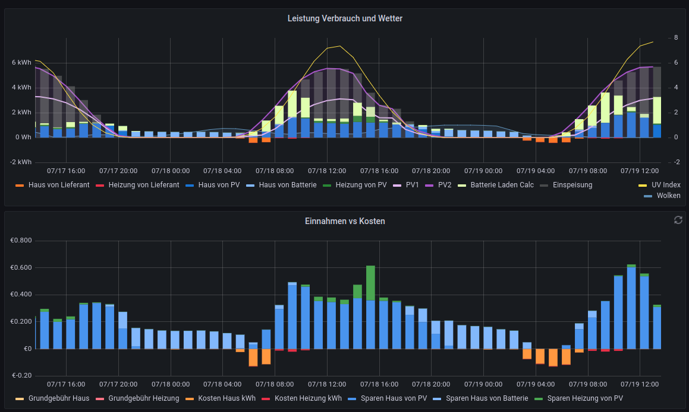
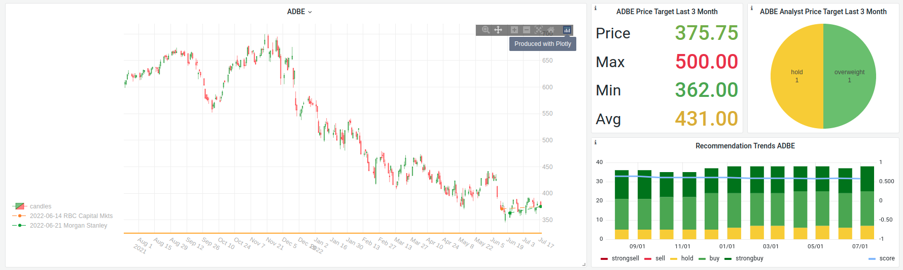

---
tags:
    - DataAnalysis
    - BigData
    - Visualization
---

# Data Analysis Tools

## [Elaticsearch (Elk Stack)](https://www.elastic.co/) 

If you have A lot of data to collect and analyze. Then the elastic stack is for you. With all programs in the elk stacks you can:

### Collect Data

- collect log Data (with [filebeat](https://www.elastic.co/de/beats/filebeat))
- collect Metrics (with [meticbeat](https://www.elastic.co/de/beats/metricbeat))
- insert and query your own Data (via json [REST api](https://www.elastic.co/guide/en/elasticsearch/reference/current/rest-apis.html)

### Visualize Data

- [Kibana](https://www.elastic.co/de/kibana/) is your Vizualization Tool in the elastic Stack

## [Grafana](https://grafana.com/)

Build interactive dashboards with Grafana. Visualize Data out of currently 139 supported Data sources which include:

- [Graphite](https://graphiteapp.org/)
- [InfluxDb](https://www.influxdata.com/)
- [Prometheus](https://prometheus.io/)
- [MSSQL](https://www.microsoft.com/de-de/sql-server/sql-server-2019)
- [MySQL](https://www.mysql.com/de/)
- [PostgreSQL](https://www.postgresql.org/)

By it's plugin Infrastructure nearly every known Datasource can be vizualized.

Example? Here!

## [Plotly](https://plotly.com/)

Plotly is a Framework for Data Visualization. It has a lot of [Libraries](https://plotly.com/graphing-libraries/) for different Languages. Want to include some nice Graphs on your website? Look at [Plotly Javascript Library](https://plotly.com/javascript/). Want to render on server side or render graphs in your python application? Look at [Plotly Python Library](https://plotly.com/python/creating-and-updating-figures/)

### Grafana Plugin

I use Plotly as Plugin for GRafana. This make Grafana Graph Plotting possibilities extremely huge.

