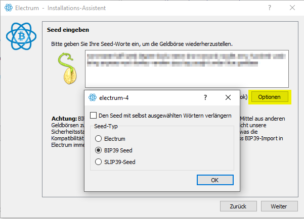
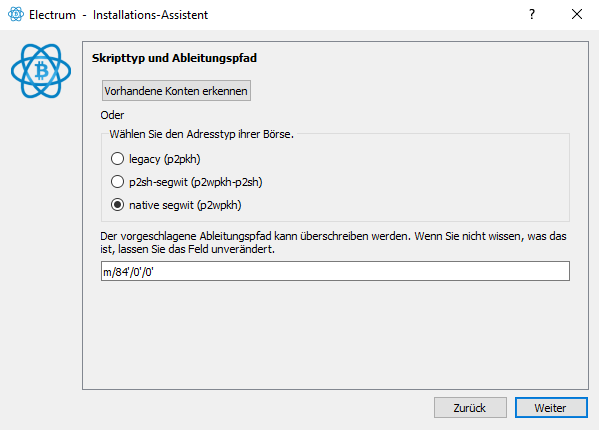
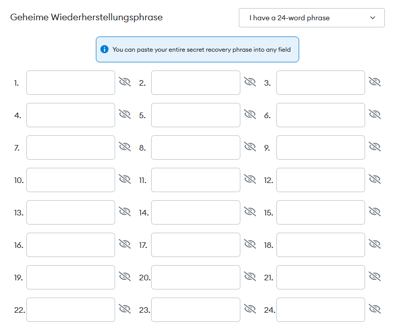

---
tags:
    - Ledger
    - Security
    - Tech
---

# Ledger Hardware Wallet HowTo

## Notfall Wiederherstellung mit Software Wallet

Das folgende sind Notfall Prozeduren für Worst Case Szenarien. Z.B. 
- dein Ledger wurde geklaut, du musst deine Coins in Sicherheit bringen bevor der Dieb den PIN des Ledgers knacken kann. Du hast keinen zweiten Ledger zur Hand
- Dein alter Ledger ist defekt. Es gibt keinen neuen Ledger zu kaufen oder du willst auf einen anderen Hersteller umsteigen

Auch wenn du deinen Ledger nicht mehr hast. Dein Backup Seed und die richtige Software sollten alles sein was du brauchst. Wenn du mit einer Notfall Methode wieder Zugriff auf deine Coins erlangt hast solltest du deine Coins **sofort auf eine andere sichere Wallet überweisen**

Ledger arbeitet mit standartisierten Seed Passphrases daher ist eine Wiederherstellung der Accounts Herstellerübergreifend auf anderen Hardware- als auch Software Wallets möglich.

- [Ledger - EXPORT YOUR ACCOUNTS](https://support.ledger.com/hc/en-us/articles/4404388633489-Export-your-accounts?docs=true)

### Technischer Hintergrund

Wenn eine Wallet erstellt wird wird eine zufällige "Mnemonic Phrase" erstellt. Das sind 12 oder 24 Wörter aus denen alle weiteren private Keys generiert werden. Ledger verwendet einen Seed nach "BIP39" Standard.
- [BIP39 Seed Standard](https://en.bitcoin.it/wiki/Seed_phrase)

BIP39 scheint nicht perfekt zu sein weswegen sich im Falle von Bitcoin die Entwickler der "Electrum" Wallet für einen eigenen Standard entschieden haben
- [Electrum Seed Version System](https://electrum.readthedocs.io/en/latest/seedphrase.html)

Auszug aus der Electrum Doku

> BIP39 was introduced two years after Electrum. BIP39 seeds include a checksum, in order to help users figure out typing errors. However, BIP39 suffers the same shortcomings as early Electrum seed phrases:
>
> - A fixed wordlist is still required. Following our recommendation, BIP39 authors decided to derive keys and addresses in a way that does not depend on the wordlist. However, BIP39 still requires the wordlist in order to compute its checksum, which is plainly inconsistent, and defeats the purpose of our recommendation. This problem is exacerbated by the fact that BIP39 proposes to create one wordlist per language. This threatens the portability of BIP39 seed phrases.
> - BIP39 seed phrases do not include a version number. This means that software should always know how to generate keys and addresses. BIP43 suggests that wallet software will try various existing derivation schemes within the BIP32 framework. This is extremely inefficient and rests on the assumption that future wallets will support all previously accepted derivation methods. If, in the future, a wallet developer decides not to implement a particular derivation method because it is deprecated, then the software will not be able to detect that the corresponding seed phrases are not supported, and it will return an empty wallet instead. This threatens users funds.

Ledger arbeitet jedenfalls nach dem BIP39 Standard. Keys werden aus dem initialen Key erstellt. **Das einzige was zufällig ist, ist der initiale Seed**

- Seed (BIP39)
  - Ledger Apps
    - Bitcoin App
      - Bitcoin privKey 1
      - Bitcoin privKey 2
    - Ethereum App (auch für EVM kompatible Chains)
      - Ethereum (oder Cronos) privKey 1
      - Ethereum (oder andere EVM kompatible) privKey2

### Notfall Wiederherstellung wenn kein Hardware Ledger zur Hand

Die folgenden Dinge habe ich mit einem temporären Seed ausprobiert. Auf diesen Seed wurden keine Coins transferriert. Der Seed wird gelöscht und das verwendete Ledger wird auf Werkseinstellungen zurückgesetzt

#### Bitcoin

Ein beliebtes OpenSource Wallet für Bitcoin ist [Electrum](https://electrum.org/). Electrum enthält die notwendige Software damit du mit deinem Seed wieder auf deine Bitcoins zugreifen kannst

Für Bitcoin Adressen gibt es verschiedene Adress Standard die man unterscheiden muss
- legacy (p2pkh)
- Segwit (p2sh-segwit) oder (p2wpkh-p2sh)
- Native Segwit (p2wpkh)

Standardmäßig generiert Ledger Live native segwit Adresen

Ob das stimmt was ich gemacht habe überprüfe ich indem ich prüfe ob die gleichen Adressen generiert werden.

**Ledger Live Bitcoin**

1. bc1qan88lzyxvh2kghncsq9kpnwxcl69hgc3axtzk9

Ledger Live kann scheinbar keine zweite Adresse generieren. Der Native Segwit Standard würde das aber hergeben

**Electrum Bitcoin**

1. bc1qan88lzyxvh2kghncsq9kpnwxcl69hgc3axtzk9
2. bc1qkskqt6ngjefwqfexpwkm7jmpemaxk5z4u7p2lz

Electrum kann zur Verschleierung von Transaktionen mehrere public Adressen generieren. Die erste Adresse stimmt überein. Also alles gut!
Wenn Electrum nun auch noch Ledger als Hardware nutzen könnte dann wär das noch besser. Aber das ist eine andere Geschichte.

#### Ethereum und EVM kompatible Chains

Ethereum ist wegen seiner Programmierbarkeit mit SmartContracts DER Wahnsinn für DeFi (Decentralized Finance geworden). Es gibt dutzende Chains die alle auf der Ethereum virtual Machine aufbauen und alle mit den gleichen Keys kompatibel sind

- [Die Top 10 der größten EVM Chains laut DefiLlama](https://defillama.com/chains/EVM)
  - Ethereum (ETH) - ERC20
  - Binance Smart Chain (BNB) - BEP20
  - Avalanche (AVAX)
  - Fantom (FTM)
  - Polygon (MATIC)
  - Cronos (CRO)
  - Arbitrum
  - Klaytn (KLAY)
  - Aurora (AURORA)
  - Harmony (ONE)

Alle diese Chains können theoretisch mit einem einzigen Ehtereum private Key bespaßt werden. Metamask macht es vor. Wenn man sich mit Metamask mit einer anderen EVM Chain verbindet wird der aktuell vorhandene private Key einfach weiterverwendet.

In Metamask kann der Seed von Ledger einfach als "24 Word Phrase" importiert werden

**Ledger Live Ethereum**

1. 0x0eDAE1b5feD047e2716cF96A665aDc36e0cD9B5D

**Metamask**

1. 0x0eDAE1b5feD047e2716cF96A665aDc36e0cD9B5D

Auch wieder alles gut.
Diese Adresse ist dann für alle EVM kompatiblen Chains gültig (siehe oben)