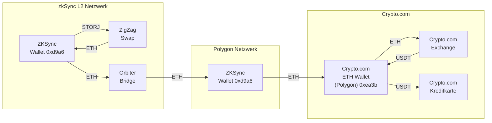

# ZKSync als Layer2 Lösung für Storj Ethereum

Mit ZKSync Lassen sich Transaction Fees auf Ehtereum dramatisch reduzieren.

- <https://wallet.zksync.io/>

Ich brauche das um meinen Storj Node rentabel zu machen

- [Storj Node Dokumentation Start](https://docs.storj.io/node/)

## zkSync Swap

Es gibt genau einen zkSync Swap auf dem ich meine Storj Token gegen etwas anderes tauschen kann.

- [ZigZag Exchange für zkSync](https://trade.zigzag.exchange/?market=STORJ-ETH&network=zksync)

## zkSync to Centralised Exchange

Und es gibt genau einen Exchange auf dem ich meine Storj Token zu Geld machen kann.

- [ByBit unterstützt zkSync](https://www.bybit.com/)

21.04.2022 : Und Stand heute ist auf ByBit zkSync offline 🤣. ABER: auf [ZigZag](https://trade.zigzag.exchange/?market=STORJ-ETH&network=zksync) kann ich STORJ für ETH Swappen und dann auf [Orbiter](https://www.orbiter.finance/?source=ZkSync&dest=Polygon) ETH vom zkSync Netzwerk nach Polygon schicken. ETH kann ich dann vom Polygon Netzwerk aus zum Crypto.com Exchange einzahlen. Easy Peasy... :

