Als info für euch was gestern passiert ist. Es gab übers Wochenende und gester einen Koordinierten Angriff auf "Anchor Protocol", "Terra (LUNA)", und UST (US Dollar Terra)

Mit Anchor ist das hier passiert

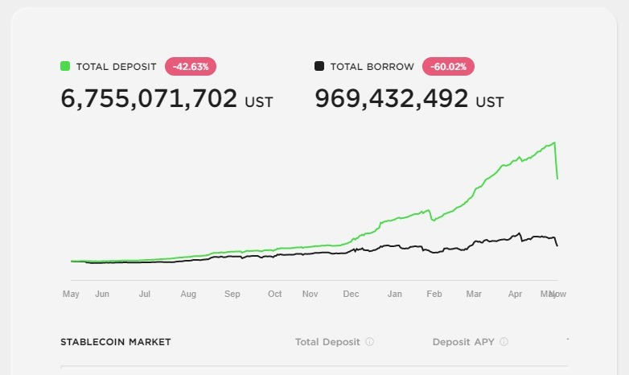

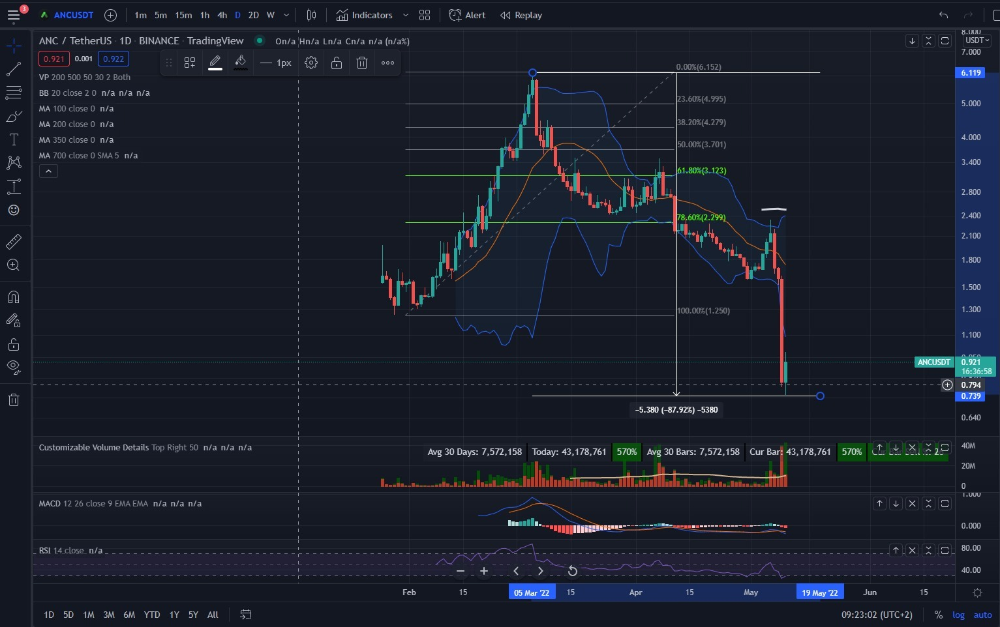

Anchor ist das größte DeFi Protokoll im Terra / LUNA Ecosystem. Hier wurden gestern 10 Milliarden Dollar vernichtet

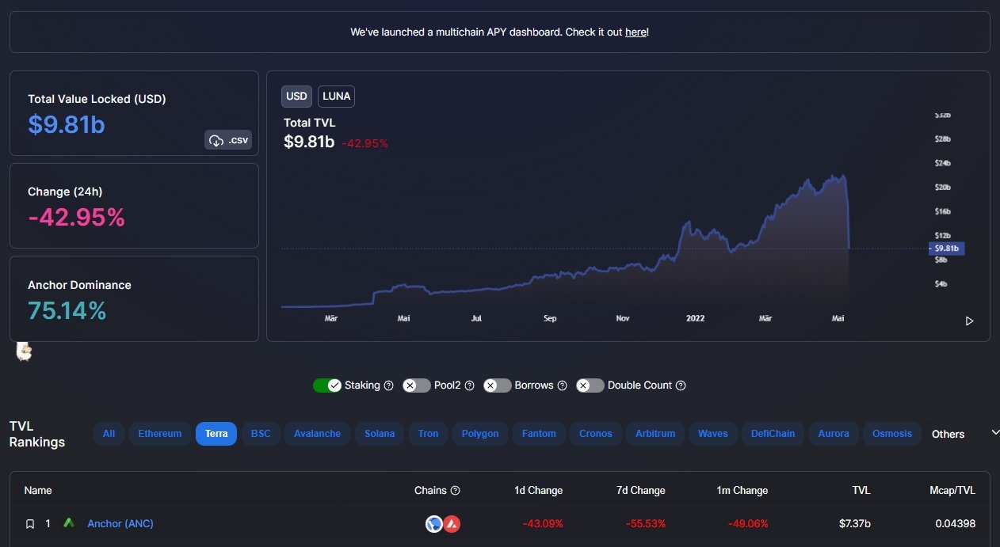

ca 7 Milliarden Dollar in UST wurden liquidiert

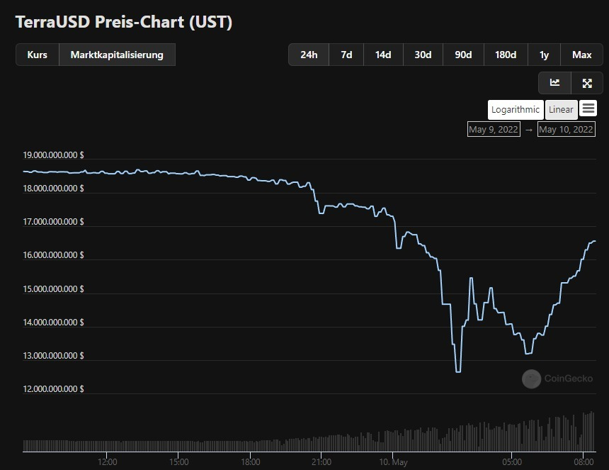

Terra hatte 80.394 BTC als "Reserve" für ihren StableCoin UST gekauft damit dieser seine Stabilitität auf 1$ halten kann 

- <https://decrypt.co/99567/luna-foundation-guard-buys-another-1-5b-bitcoin-back-terra-stablecoin>

Beim Angriff wurde der Stablecoin UST gestern massiv runtergedrückt auf bis zu 0,61$ (der Coin sollte eigentlich immer 1\$ kosten)

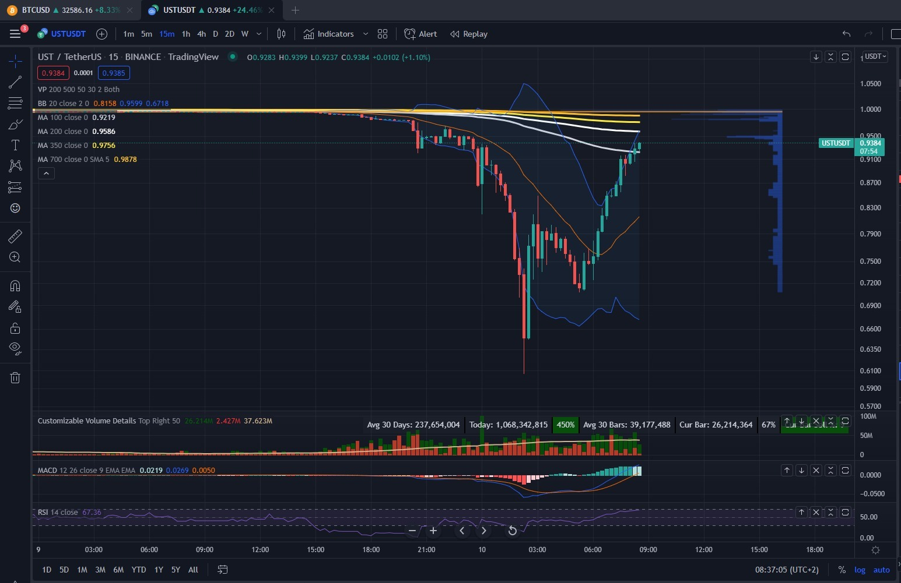

Das führte gleichzeitig zu einer massiven Liquidierung von BTC (weil Terra diese ja als Sicherheit für UST hinterlegt hat). Somit haben sich ein paar große Wale (oder einer?) viele billige BTC abgestaubt.

Justin Sun (Tron networks) (TRX) meinte am Sonntag, dass er UST kaufen würde

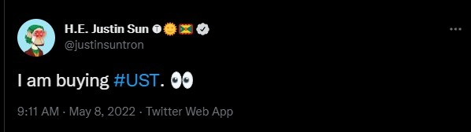

wahrscheinlich nur um "Short" zu gehen also beim Angriff auf UST mitzumachen und UST aus dem Markt zu drängen.

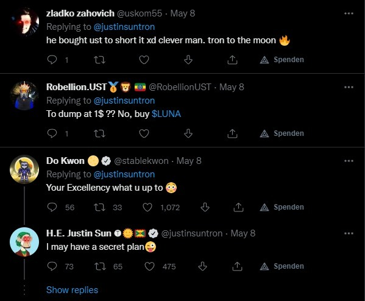

Wahrscheinlich hat er sich gleichzeitig um einige tausend Bitcoin bereichert. Seit gestern Abend wechseln plötzlich viele Bitcoin den Besitzer.
diese größer werdenden Balken oben in der Mitte sind das "Volumen". Grün geschätztes Kaufvolumen Rot geschätztes Verkaufsvolumen

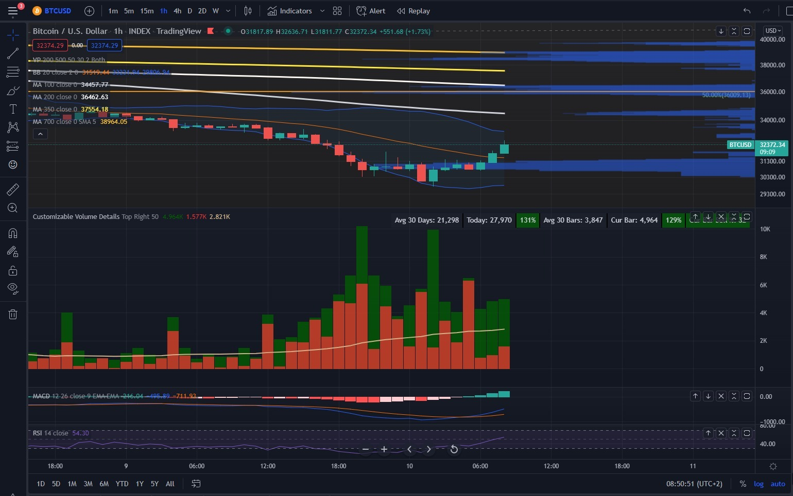

alle großen Krypto Unternehmen werden ganz genau den 4 JahresZyklus von Bitcoin kennen. Ganz einfach gesagt 3 Jahre rauf - 1 Jahr runter. Wir befinden uns jetzt (wie ich schon so oft gesagt habe mitten in einem roten Jahr. 

Ok ich befasse mich jetzt erst seit einem Jahr mit dem Zeug -> also alles nur nach bestem Wissen und Gewissen

**und Anlageberatung darf ich sowieso nicht machen**

Aber ich vermute die großen machen folgendes. Während des bärischen (roten) Jahres schlachten sie sich gegenseitig ab. Wer genügend vorgesorgt hat wird überleben, wer nicht der verschwindet vom Markt.

Bitcoin ist die härteste Währung die diese Leute kennen. Davon wird es exakt 21 Millionen geben und keinen einzigen mehr ( <https://www.btc-echo.de/news/bitcoin-warum-wird-es-nie-mehr-als-21-millionen-btc-geben-102393/>)

während "Bärenmärkten" kann man "billige Bitcoin" abstauben. Und das kann man noch besser wenn man seine Gegner manipuliert und denen ihre Bitcoin abluchsen kann

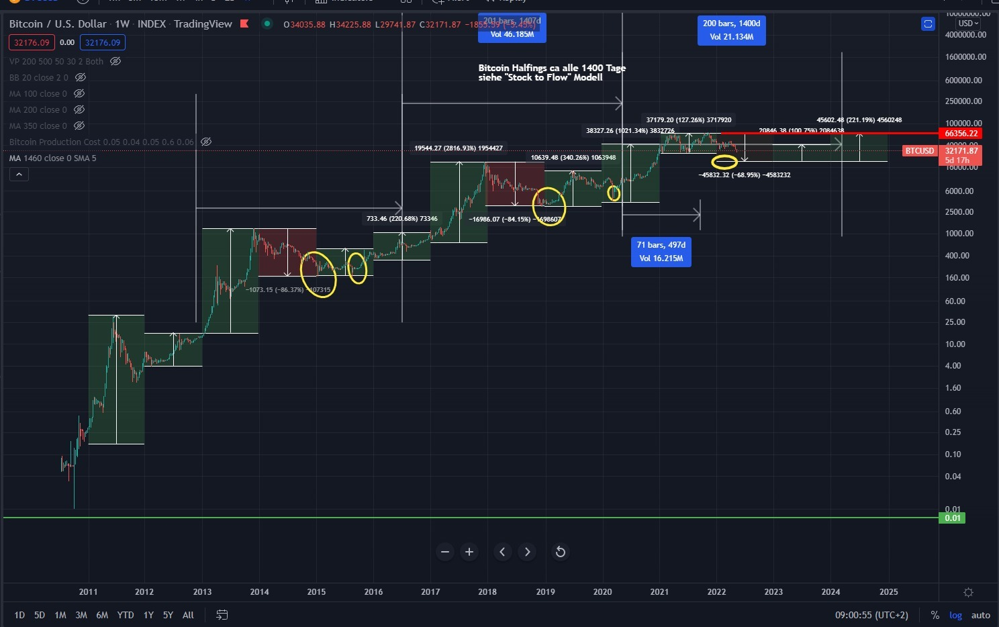

Wenn keiner die Bitcoin verkauft, kann man sie ja nicht billger kaufen. Nun hat Bitcoin gegenüber all diesen anderen (Proof of Stake) Coins eine Besonderheit. Es ist Proof of Work (wie übrigens Ehtereum auch (noch). Es wird tatsächlich "produziert" wie ein Rohstoff. Und in der USA wird Bitcoin als Rohstoff anerkannt
- <https://www.blocktrainer.de/lummis-informationen-krypto-gesetz/>

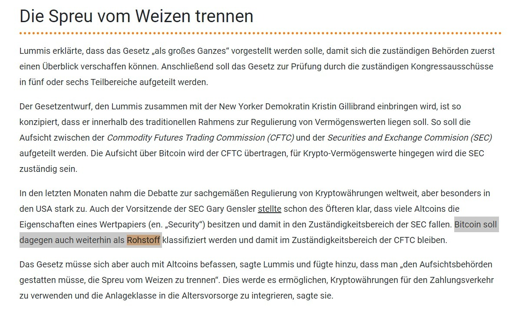

Der Rohstoff Bitcoin wird von den Minern produziert. Nämlich indem Energie Mithilfe von Rechnern (in diesem Fall ASICs) in Bitcoin umgewandelt wird. Dadurch entstehen Fixkosten (für die Geräte) und variable Kosten (für die Elektrizität). Die Kosten der Miner lassen sich errechnen, da die Allgemeine "Hashrate" (die Rechenleistung) des Bitcoin Netzwerkes überwacht werden kann.

Jemand hat sich die mühe gemacht und dafür einen Indikator für TradingView programmiert

Und sowas aber auch. Fällt der Bitcoin Preis unter die Gesamtkosten, dann bleibt Bitcoin da nicht lange. Fällt Bitcoin unter die FIXKosten. Gibt kein Miner der Welt mehr seine Bitcoins her (vermute ich mal) der Preis steigt wieder bis die Kosten gedeckt werden

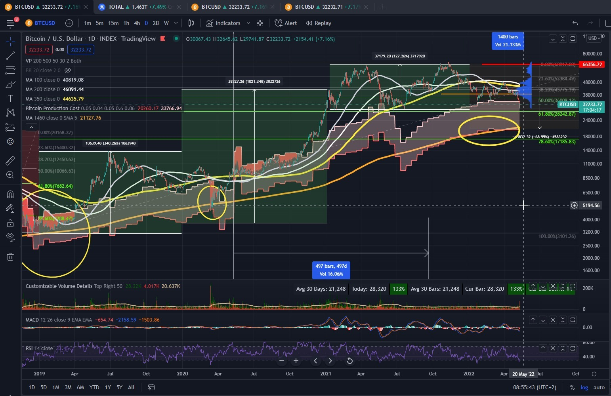

Die obere Linie des roten Bereiches sind die "Bitcoin Produktion Gesamtkosten" die untere Linie des roten Bereiches sind die "Fixkosten"

und jetzt scroll ich mal so weit raus wie ich hier kann

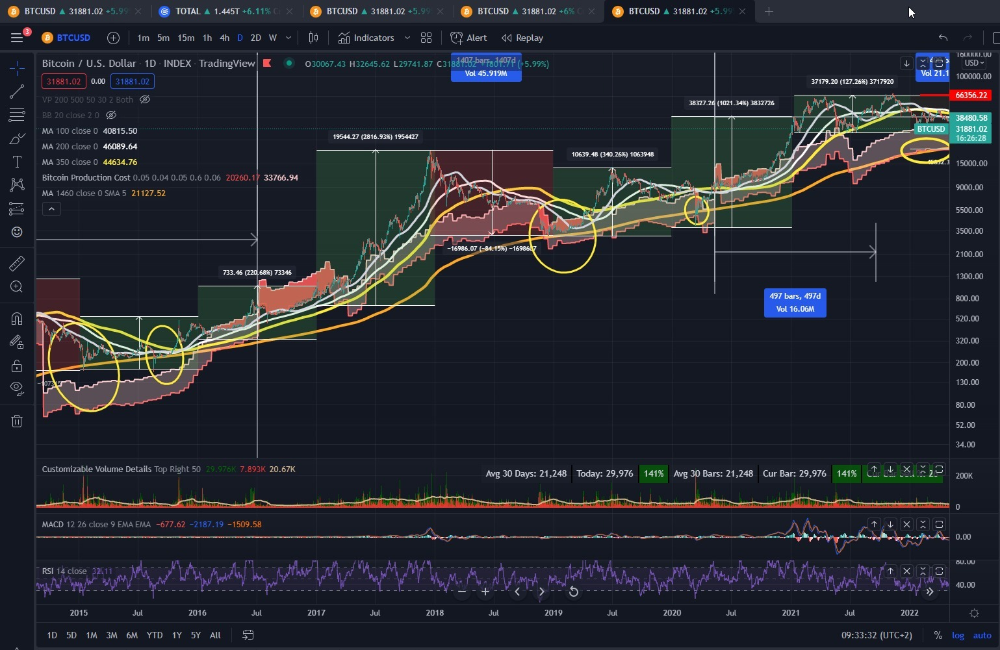

Und die Hashrate (Rechenleistung, Bitcoin variable Kosten). Macht gerade sowas hier....

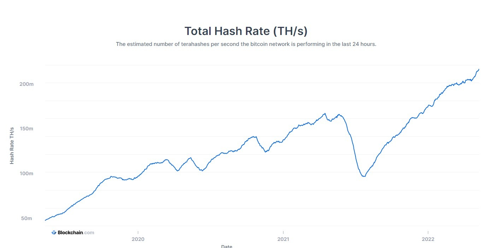

Apropos Bitcoin Verbot in China.....

Chia (XCH) Farmer Verteilung auf der Welt....

Chia (XCH) (Proof of Space and Time) erfüllt die gleichen Anforderungen an einen Rohstoff wie Bitcoin (Proof of Work). Nur versteht das der Großteil der Welt noch nicht. Vielleicht in 10 Jahren...

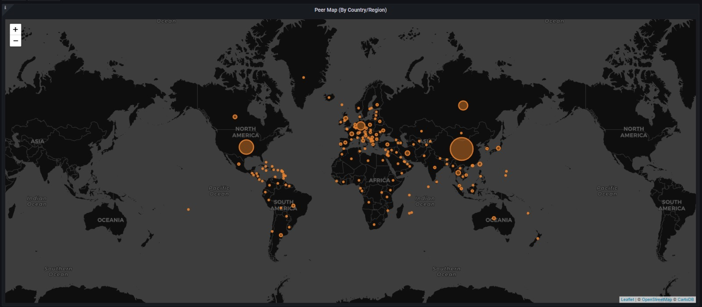

aber ca 200.000 Leute verstehen das schon

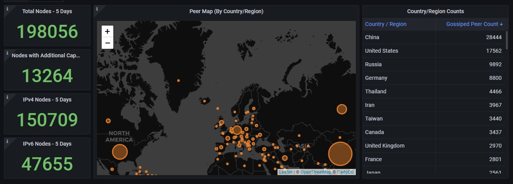

Bei Bitcoin ist der "Rohstoff" die Permamente Aufrechterhaltung einer Energieversorung des Netzwerks und damit der Hashrate.

Bei Chia ist der hauptsächliche "Rohstoff" der Speicherplatz der über einen bestimmten Zeitraum zur Verfügung gestellt wird (wie ein Grundstück das du verpachtest). Deswegen Bitcoin "Miner" (schuftet und arbeitet im Bergwerk / Mining). und Chia "Farmer" (verwendet seinen Platz (Storage / Speicherplatz) um seinen Rohstoff anzubauen (Plotten) und dann zu Ernten (Harvesting).

Dass Nixxon 1971 den Goldstandard aufgehoben hatte wusste ich bereits. Aber nicht WARUM? Wegen dem Vietnamkrieg und die USA sich finanziell übernommen hatte. DARUM

- <https://www.welt.de/finanzen/article13546275/Vor-40-Jahren-begann-die-Aera-des-Gelddruckens.html>

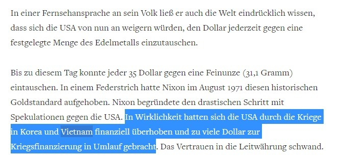
